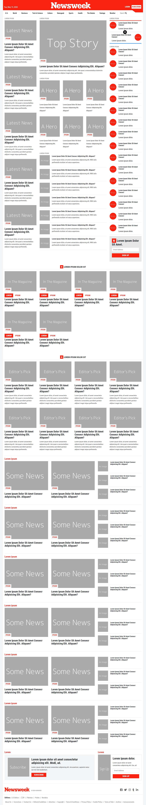

# Newsweek

> A clone for the newsweek website.

## Screenshot

## Live Preview

Click [here](https://raw.githack.com/aldemeery/newsweek-clone/develop/index.html) for a live preview.

## Authors

👤 **Osama Aldemeery**

- Github: [@aldemeery](https://github.com/aldemeery)
- Twitter: [@aldemeery](https://twitter.com/aldemeery)
- Linkedin: [osamaaldemeery](https://linkedin.com/in/osamaaldemeery)

## 🤝 Contributing

Contributions, issues and feature requests are welcome!

Feel free to check the [issues page](issues/).

## Show your support

Give a ⭐️ if you like this project!

## 📝 License

This project is [MIT](LICENSE) licensed.
